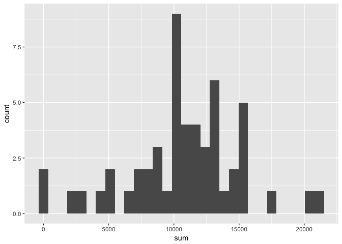
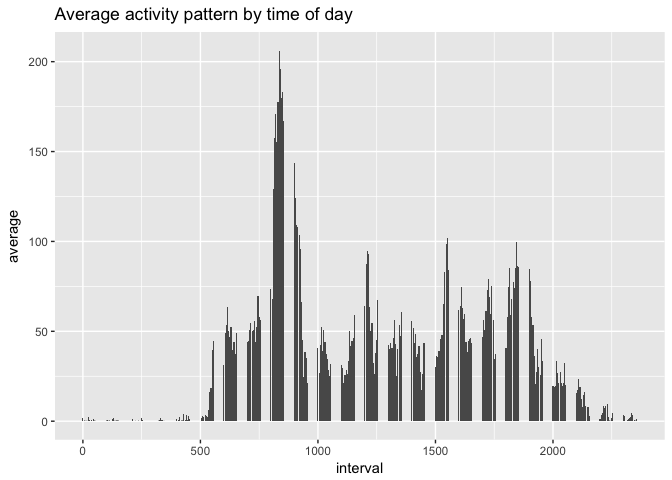
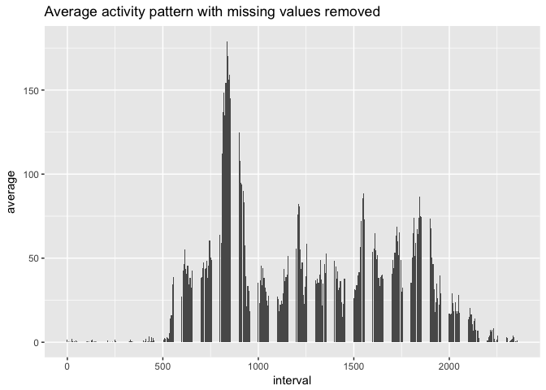
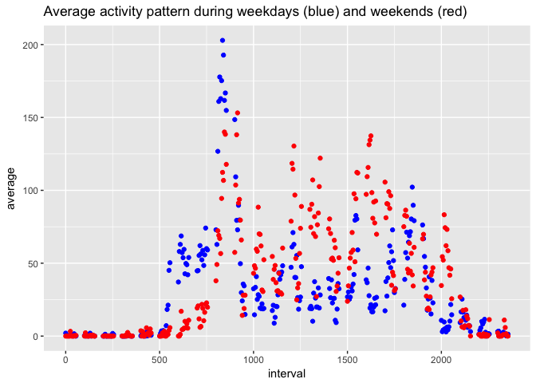

## Libraries Used:

```r
library(tidyverse)
```

```
## ── Attaching packages ────────────────────────────────── tidyverse 1.2.1 ──
```

```
## ✔ ggplot2 2.2.1     ✔ purrr   0.2.4
## ✔ tibble  1.4.2     ✔ dplyr   0.7.4
## ✔ tidyr   0.8.0     ✔ stringr 1.3.0
## ✔ readr   1.1.1     ✔ forcats 0.3.0
```

```
## ── Conflicts ───────────────────────────────────── tidyverse_conflicts() ──
## ✖ dplyr::filter() masks stats::filter()
## ✖ dplyr::lag()    masks stats::lag()
```


## Loading and preprocessing the data


```r
unzip ("activity.zip", exdir = "./")
steps_raw<-read.csv("activity.csv", header = TRUE)
```


```
## `stat_bin()` using `bins = 30`. Pick better value with `binwidth`.
```

```
## Warning: Removed 8 rows containing non-finite values (stat_bin).
```

<!-- -->


## What is mean total number of steps taken per day?


```r
steps_raw %>% na.exclude() %>% summarise(mean = mean(steps), n = n())
```

```
##      mean     n
## 1 37.3826 15264
```

## What is median total number of steps taken per day?


```r
steps_raw %>% na.exclude() %>% summarise(median = median(steps), n = n())
```

```
##   median     n
## 1      0 15264
```


## What is the average daily activity pattern?


```r
average_pattern<-steps_raw %>% na.exclude() %>% group_by(interval) %>% summarise(., mean = mean(steps), n = n()) %>% as.data.frame() 

names(average_pattern)<-c ("interval", "average", "n")
average_pattern_plot<-average_pattern %>%
  ggplot(aes(x = interval, y = average)) + 
  geom_bar(stat = "identity")

print(average_pattern_plot + ggtitle("Average activity pattern by time of day"))
```

<!-- -->


## Imputing missing values


```r
mean.activity<-steps_raw  %>% group_by(date) %>% summarise(mean = mean(steps), na.rm=TRUE)
steps_imputed<-steps_raw %>% group_by(date) %>% mutate( steps = replace(steps, is.na(steps), mean(steps, na.rm = TRUE))) %>%
  mutate( steps = replace(steps, is.nan(steps), 0))

average_pattern_imputed<-steps_imputed  %>% group_by(interval) %>% summarise(., mean = mean(steps), n = n()) %>% as.data.frame() 

names(average_pattern_imputed)<-c ("interval", "average", "n")
average_pattern_clean<- average_pattern_imputed %>%
  ggplot(aes(x = interval, y = average)) + 
  geom_bar(stat = "identity")


print(average_pattern_clean + ggtitle("Average activity pattern with missing values removed"))
```

<!-- -->

## Are there differences in activity patterns between weekdays and weekends?


```r
steps_imputed<-as.data.frame(steps_imputed)

steps_weekend<- steps_imputed %>% mutate(WeekDay= steps_imputed$date %>% as.Date() %>% weekdays.Date()) %>% 
mutate(WeekEnd = case_when(.$WeekDay %in% c("Saturday", "Sunday") ~ "weekend",  .$WeekDay %in%
                             c("Monday", "Tuesday", "Wednesday", "Thursday", "Friday")
                             ~ "workday")) %>%
  filter(WeekEnd == "weekend")

steps_workday<- steps_imputed %>% mutate(WeekDay= steps_imputed$date %>% as.Date() %>% weekdays.Date()) %>% 
mutate(WeekEnd = case_when(.$WeekDay %in% c("Saturday", "Sunday") ~ "weekend",  .$WeekDay %in%
                             c("Monday", "Tuesday", "Wednesday", "Thursday", "Friday")
                             ~ "workday")) %>%
  filter(WeekEnd == "workday")

average_pattern_workday<-steps_workday  %>% group_by(interval) %>% summarise(., mean = mean(steps), n = n()) %>% as.data.frame()
average_pattern_weekend<-steps_weekend  %>% group_by(interval) %>% summarise(., mean = mean(steps), n = n()) %>% as.data.frame()
names(average_pattern_workday)<-c ("interval", "average", "n")
names(average_pattern_weekend)<-c ("interval", "average", "n")

average_weekendsvsworkdays<- 
 ggplot(data = average_pattern_workday, aes(x = interval, y = average)) +
geom_point(color = "blue") +
  geom_point(data=average_pattern_weekend, aes(x = interval, y = average), colour='red') 
  


print(average_weekendsvsworkdays + ggtitle("Average activity pattern during weekdays (blue) and weekends (red)"))
```

<!-- -->

